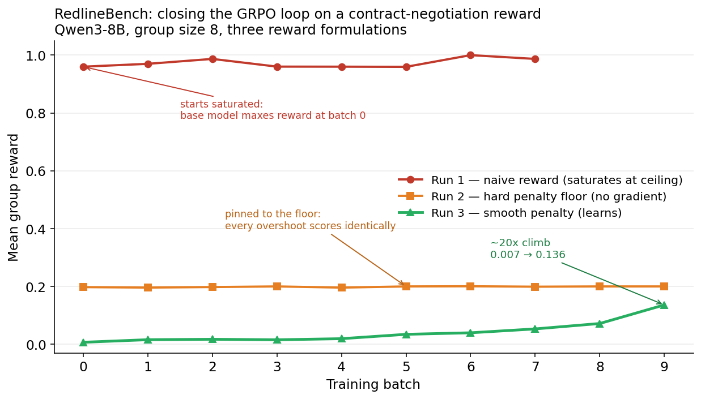

# Closing the loop on RedlineBench: what a flat reward curve taught me about reward design

I built a small RL environment for contract-clause negotiation, ran GRPO on it end to end with Tinker, and the very first training curve was flat. Not flat because the model failed to learn. Flat because there was nothing to learn. Chasing down *why* turned into the most useful part of the project, and it produced three curves instead of one.

This is a writeup of that, in the spirit of the SalesBench-style "train a model, find the reward hack, report it honestly" posts. The headline result is a real before/after climb. The actual lesson is about how easy it is to ship a reward that can't train anything, and how to tell.

## The environment

RedlineBench is a single-turn negotiation. The policy plays the buyer's counsel arguing for a liability cap. It sees the opposing counsel's opening offer and replies with a counter-anchor, a single dollar figure. A deterministic vendor then runs the negotiation forward: it accepts anything at or below its threshold, otherwise it concedes a fixed fraction of the gap per round over three rounds, and the deal settles at the midpoint of the final two offers.

The reward, `score_outcome`, grades the final agreed cap against the client's interests. A cap at or below the walk-away point is worthless (0.0). A cap at the client's ideal is perfect (1.0). In between, linear.

Because the vendor is deterministic, the whole episode is a deterministic function of one number: the buyer's anchor. That is what makes it a clean training target. It is also, it turns out, exactly what makes the naive reward impossible to train.

## Run 1: the reward saturates immediately

I ran GRPO on Qwen3-8B, group size 8, ten batches. Here is the curve:

| batch | 0 | 1 | 2 | 3 | 4 | 5 | 6 | 7 |
|---|---|---|---|---|---|---|---|---|
| reward | 0.960 | 0.970 | 0.987 | 0.960 | 0.960 | 0.960 | 1.000 | 0.987 |

Batch 0 is the untrained baseline, and it already scores 0.96. The reward never meaningfully moves after that. One batch even logged "all advantages zero, skipping update."

The cause is in the reward:

```python
if agreed_cap >= CLIENT_IDEAL:
    return 1.0
```

Nothing caps the buyer's anchor. So a competent base model immediately discovers that anchoring absurdly high (tens of millions, against a five-million ideal) clears the threshold and pins the reward at exactly 1.0. Anchor 6M, score 1.0. Anchor 60M, score 1.0. Anchor a billion, score 1.0.

GRPO learns from *differences within a group*. It samples 8 responses to the same prompt, scores them, and pushes the policy toward the above-average ones. If every sample already scores ~1.0, the advantages are all zero and there is no gradient. The model can't improve because, by the reward's own definition, it is already perfect on the first try.

This is the reward-hacking finding, and it is the most important part of the project: **the reward was trivially saturable, and a base model saturated it before training began.** A naive reading of the curve ("starts high, stays high") looks like success. It is the opposite. It is a benchmark that can't distinguish a skilled negotiator from one shouting the biggest number it can think of.

## Run 2: a hard penalty kills the gradient a different way

The obvious fix is to punish overreaching. A real opening that absurd gets you walked away from; it shouldn't score 1.0. So I replaced the flat ceiling with a penalty for overshooting past the ideal:

```python
if agreed_cap >= CLIENT_IDEAL:
    overshoot = (agreed_cap - CLIENT_IDEAL) / (CLIENT_IDEAL - CLIENT_WALKAWAY)
    return max(0.2, 1.0 - overshoot)
```

The curve:

| batch | 0 | 1 | 2 | 3 | 4 | 5 | 6 | 7 | 8 | 9 |
|---|---|---|---|---|---|---|---|---|---|---|
| reward | 0.198 | 0.196 | 0.198 | 0.200 | 0.196 | 0.200 | 0.201 | 0.199 | 0.200 | 0.200 |

Flat again, but now at the *floor* instead of the ceiling. The penalty worked in the sense that absurd anchors no longer score 1.0; the whole curve collapsed from ~0.97 to ~0.20. But the model's anchoring was so extreme that the overshoot was enormous, `1.0 - overshoot` went deeply negative, and `max(0.2, ...)` clamped every single rollout to exactly 0.2.

Same failure as Run 1, opposite end. An anchor of 6M and an anchor of 60M both hit the floor and score identically, so the group has no spread, and again there is no gradient. **A penalty that clamps is just a ceiling upside down.** Fixing saturation isn't enough; the reward has to *discriminate* across the range the policy actually explores.

## Run 3: a smooth penalty finally gives a slope

The fix was to remove the clamp and let the penalty decay smoothly, so a smaller overshoot always scores strictly higher than a larger one:

```python
if agreed_cap >= CLIENT_IDEAL:
    overshoot = (agreed_cap - CLIENT_IDEAL) / (CLIENT_IDEAL - CLIENT_WALKAWAY)
    return 1.0 / (1.0 + overshoot)   # smooth decay, never flat
```

This is 1.0 at the ideal, 0.5 one span past it, and keeps shrinking forever without ever flattening. Now the 8 anchors in a group land on 8 different scores, and GRPO has a direction to push.

The curve:

| batch | 0 | 1 | 2 | 3 | 4 | 5 | 6 | 7 | 8 | 9 |
|---|---|---|---|---|---|---|---|---|---|---|
| reward | 0.0069 | 0.0158 | 0.0173 | 0.0155 | 0.0193 | 0.0344 | 0.0397 | 0.0531 | 0.0718 | 0.1361 |

That climbs, about 20x from baseline, and it accelerates in the back half (0.034 → 0.040 → 0.053 → 0.072 → 0.136). The model starts by overshooting wildly (near-zero reward under the smooth penalty), and GRPO pulls its anchors back toward the ideal, so the reward genuinely rises. This is the real before→after.

## Why three curves beats one

If I had only ever run the smooth version, I'd have a tidy climbing line and a much weaker story. The three runs together are the point:

- **Run 1** flat at the top: the reward is saturable, and a base model saturates it.
- **Run 2** flat at the bottom: a clamping penalty fixes saturation but reintroduces a flat region, so still no gradient.
- **Run 3** climbing: a smooth, monotonic penalty is what actually produces a learnable signal.

The thing that makes a reward trainable isn't that it's "harder." It's that it varies, with a real slope, across the exact region the policy explores. Both flat curves were the same bug wearing different clothes.

## Honest limitations

This is a deliberately small result and I want to be clear about its edges.

The deeper issue is that RedlineBench's optimal action is a *constant*: anchor as high as the reward tolerates, independent of the opening offer, because the vendor is deterministic and its threshold is fixed and known. A reward shaped well enough to train is really just teaching the policy to find that constant. That is a legitimate optimization target and it produced a real curve, but it is not yet a rich negotiation.

The genuinely interesting v2, which I'm building next, hides the vendor's walk-away point and varies it per episode, so the optimal anchor depends on state the model has to infer from the opening offer. That turns "find the best constant" into "read the signal and adapt," which is where the environment becomes worth training on for its own sake rather than as a reward-design exercise.

Runs were 10 batches at group size 8 on Qwen3-8B via Tinker, with temperature raised to 1.2 in the later runs to keep the group spread wide enough to learn from. Short runs, single seed. The shape of the three curves is the result, not the absolute numbers.

## What I take from it

The loop works: environment, deterministic scorer, GRPO with group-relative advantages, real weight updates, a measured before/after. But the part I'd actually want a reviewer to read is the diagnosis. Knowing *why* a reward won't train, and being able to tell a flat-because-saturated curve from a flat-because-clamped one from a real climb, is the skill the curve is only evidence of.
